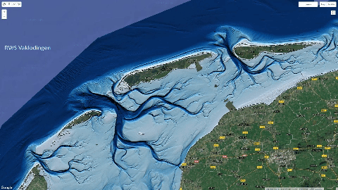

This project is carried our in the frame of KPP-CIP projects in 2018. The project **KPPCIP2018 IV INNO Satellieten en bathymetrie voor monitoring kustmorfologie** proposed by  _Deltares_ has been awarded by _Rijkswaterstaat_ in November 2017. 

* * *

## [](#intro)Introduction

Within this project, _Deltares_ is asked to look at availble satellite images in the period 2015-2017 and explore ways to derive bathymetry from those images. Eventually Deltares provides a calibrated bathymetry for two areas of interest and compares the obtained bathymetry with _in-situ_ data collected via standard measurment methods.

## [](#areas)Areas of interest

The two areas are both located in the North Sea area: the inlet of Ameland island in the Wadden Sea and the Western Scheldt outerdelta. These areas are characterised by active coastal morphodynamics, especially in the shallow waters. The use of remote sensing images for these areas helps to capture higher frequency dynamics, too costly and spatially confined to be fully detected by standard in-situ measurements.


## [](#data)Data availability

As a rich data country, The Netherlands is monitoring its 350 km of coast at a yearly rate. For the purpose of his study, several datasets of measurement observations are explored, analysed, and compared against remote sensing products. Here is a list of data used during the project.

### [](#insitu)In-situ data
* **Water levels**. Measurements from devices in the surroundings of the areas of interest have been downloaded from Matroos[GIVE LINK URL!!! ]
* **Jarkus transects**. Profiles measured along the Dutch coast, measured on a yearly basis with singlebeam mounted on boats and lidar sensor mounted on planes. This dataset is mainly used for validation of satellite-derived produtcs.
* **Vaklodingen 2d map**. Multibeam measurements performed with ships. Approximately 3 years of overpass, depending on the area. This dataset is mainly used for validation of satellite-derived produtcs.
* **LIDAR 2d map**. Measurements from airborne mounted radar operating in the optical spectrum.


**Water level signal** 
[Google Earth Engine code](https://code.earthengine.google.com/e02d1005a3aac1c10d09fe85f23a8edd) which imports shapefiles of water level data, and displays the locations of the buoys and plots a subset of this data.

**Jarkus transects**


**RWS Vaklodingen Data**


### [](#satellites)Remote sensing data
* **Sentinel2**. European EO mission launched in 2015 (A) and 2017 (B). It provides multi-spectral data in the visible, near infrared and short wave infrared part of the spectrum.
* **LandSat8**. American EO mission launched in 2013. It provides multi-spectral images thanks to the OLI (Operational Land Imager) and Thermal InfraRed sensors.
* **TripleSat**. Commercial Satellite sensor, made available by NSO (Netherlands Space Office).
* **RapidEye**. Commercial Satellite sensor, made available by NSO (Netherlands Space Office).


### [](#additional)Additional data
* **Cloud coverage?**. Available online. Used to determine a threshold to automatically discard icloudy images.
* **Bathymetric Products**. Processed data from a third commercial party. 

## [](#methodology)Methodology


```js
// Javascript code with syntax highlighting.
// Feel free to add JS snippets, for example to show how to upload collections,
// or how do you implement algorithms (as mean, thresholding, random forest, ...)
```

```python
# Python code as well if needed.
```


## [](#results)Results


### [](#validation)Validation and Comparison

**Water levels**


Water level measurements plotted in gray have been derived from a buoy off the coast of Nes, The Netherlands (5.7609, 53.4311). Corresponding cloud-free images between 2015 to the present from Landsat 8 and Sentinel 2 are plotted in red and blue, respectively.

[Video](https://player.vimeo.com/video/264566972) of false colour Landsat 8 and Sentinel 2 images, sorted by water levels recorded at Nes buoy.

[Video](https://player.vimeo.com/video/264566971) of RGB Landsat 8 and Sentinel 2 images, sorted by water levels recorded at Nes buoy.

[Code]() which creates and exports above videos.

Images from Landsat 8 and Sentinel 2, filtered by years 2015 to the present and cloud cover, then sorted by water level from in-situ Matroos data. Location in the Netherlands, along the North Sea (6.20, 53.41).

**Reconstructed Bathymetry**



Visual comparison of the vaklodingen data and the reconstructed bathymetry from this project.

**Correlation Map of Reconstructed Bathymetry with Vaklodingen**


Visual representation of the correlation between the vaklodingen and the reconstructed bathymetry. Green represents areas of high correlation (> 0.95), and red represents areas of lower correlation (value?) between data.

## [](#ref)References
